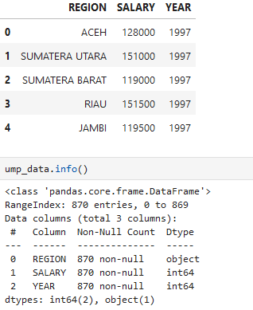
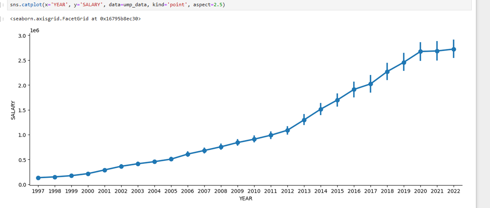
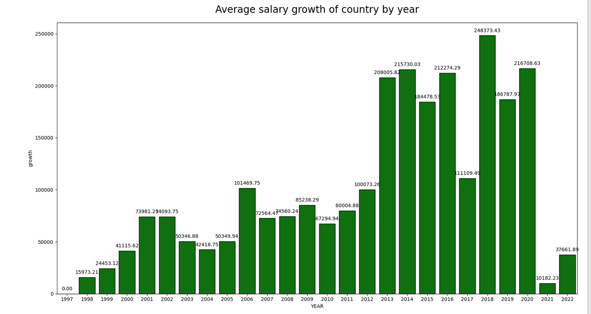
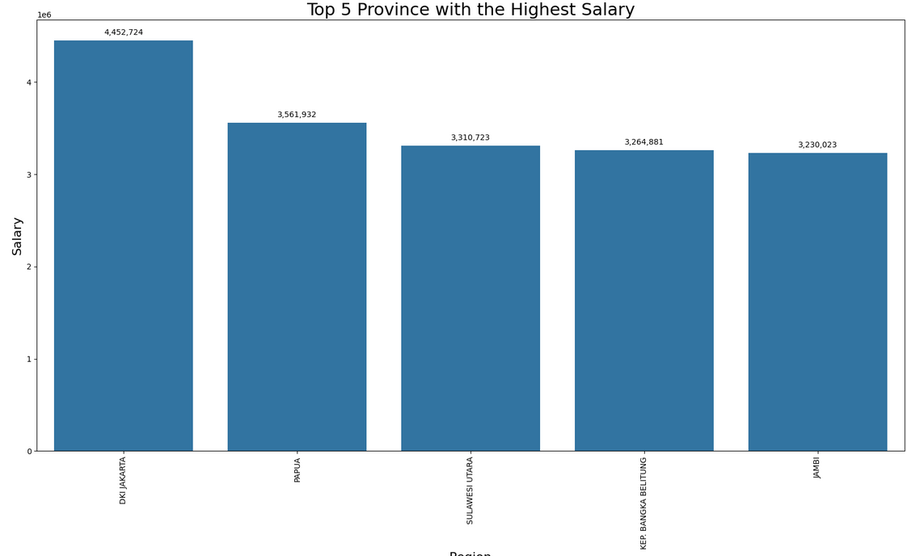
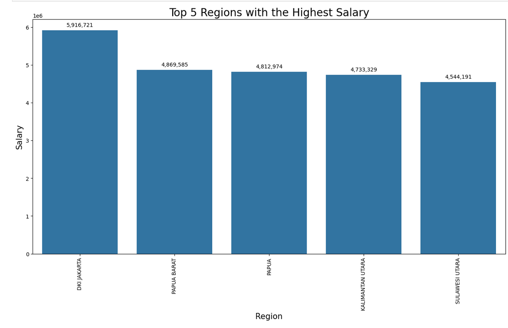

## Iqbal Esta Maulana
## A11.2022.14065

# Prediksi Gaji Masyarakat 10 Tahun kedepan

## Ringkasan dan Permasalahan

Hasil penelitian ini adalah prediksi nilai UMP dari 26 Provinsi di Indonesia. Sebelum prediksi dilakukan, UMP di Indonesia terus meningkat seiring dengan pertumbuhan ekonomi. Prediksi menggunakan model Machine Learning Linear Regression memperpanjang dataset dari 1997 hingga 2032, menunjukkan perkembangan signifikan. Prediksi ini menunjukkan potensi kemajuan ekonomi Indonesia.

## Tujuan

Menganalisis tren gaji historis di Indonesia dari 1997 hingga 2022.
Memprediksi gaji hingga tahun 2032 menggunakan regresi linear.
Mengidentifikasi wilayah dengan gaji tertinggi dan faktor-faktor penyebabnya.
Menilai dan memprediksi tingkat pertumbuhan gaji rata-rata tahunan.
Memvisualisasikan perubahan gaji antar wilayah dan waktu.
Menyediakan informasi untuk membantu pengambilan keputusan terkait pasar tenaga kerja dan perencanaan ekonomi di Indonesia.

## Model

Penggunaan model regresi linier yang diperkuat dengan jaringan saraf tiruan (Neural Network).

## Alur Project

Pengumpulan dan Ekstraksi Data

    File zip berisi data UMP Indonesia dari tahun 1997 hingga 2022 diunduh dan diekstraksi.

Import dan Pembersihan Data

    Data diimport menggunakan pandas dan berbagai library lainnya, kemudian dilakukan pembersihan data, termasuk konversi nilai UMP menjadi numerik.

Analisis Data Awal

    Data awal dianalisis dengan visualisasi menggunakan seaborn untuk melihat tren dan pertumbuhan rata-rata UMP tiap tahun.
    Pertumbuhan UMP dihitung dan divisualisasikan dalam bentuk bar plot.

Analisis Per Provinsi

    Lima provinsi dengan nilai UMP tertinggi diidentifikasi dan divisualisasikan.
    Data diurutkan berdasarkan tahun untuk setiap provinsi dan model regresi linear dibuat untuk setiap provinsi.

Prediksi UMP Masa Depan

    Prediksi UMP untuk sepuluh tahun ke depan (2023-2032) dilakukan menggunakan model regresi linear yang telah dibuat.
    Data hasil prediksi digabungkan dengan data historis untuk analisis lebih lanjut.

Visualisasi Prediksi

    Pertumbuhan rata-rata UMP dari tahun 2022 hingga 2032 divisualisasikan.
    Perubahan nilai UMP dari tahun 1997 hingga 2032 divisualisasikan dalam bentuk plot garis.
    Visualisasi dinamis menggunakan plotly untuk melihat perubahan UMP tiap provinsi dari tahun ke tahun.

## Dataset

Dataset berasal dari Kaggle
Dataset ini berisi informasi tentang Upah Minimum Provinsi (UMP) di Indonesia dari tahun 1997 hingga 2022.
Data ini mencakup UMP untuk berbagai provinsi di Indonesia sepanjang periode 

    Region = Province selected
    Salary = Number of salary in IDR
    Year = Years when the salary applied

### EDA (Exploratory Data Analysis)??

Import Libraries dan Data
Preview Data

Distribusi Nilai UMP

Rata-rata UMP per Tahun

Top 5 Provinsi dengan UMP Tertinggi

### Proses features Dataset
Preprocessing Data
ump_data = ump_data.reset_index(drop=True).groupby('REGION').apply(lambda x: x.sort_values('YEAR'))

models = {}
for provinsi in ump_data['REGION'].unique():
    X = ump_data.loc[ump_data['REGION'] == provinsi]['YEAR'].values.reshape(-1, 1)
    y = ump_data.loc[ump_data['REGION'] == provinsi]['SALARY'].values.reshape(-1, 1)
    model = LinearRegression().fit(X, y)
    models[provinsi] = model

## Proses Learning/Modeling

1. Prediksi UMP Masa Depan
future_years = np.array(range(ump_data['YEAR'].max() + 1, ump_data['YEAR'].max() + 11))
future_ump = []
for provinsi in ump_data['REGION'].unique():
    model = models[provinsi]
    future_ump_provinsi = model.predict(future_years.reshape(-1, 1))
    future_ump.extend(future_ump_provinsi)

future_df = pd.DataFrame({
    'REGION': np.repeat(ump_data['REGION'].unique(), 10),
    'YEAR': np.tile(range(ump_data['YEAR'].max() + 1, ump_data['YEAR'].max() + 11), ump_data['REGION'].nunique()),
    'SALARY': future_ump
})

future_df['SALARY'] = future_df['SALARY'].astype(int)

2. Menggabungkan Data

'combined_df = pd.concat([ump_data, future_df], axis=0, ignore_index=True)'

3. Visualisasi Prediksi UMP Masa Depan

AVG = combined_df.sort_values(by='YEAR', ascending=True)
AVG['Growth'] = [0] + [AVG['SALARY'].iloc[i] - AVG['SALARY'].iloc[i-1] for i in range(1, len(AVG))]

plt.figure(figsize=(15, 12))
plt.title("Average salary growth from 2022 - 2032", size=20, pad=20)
AVG_filtered = AVG.query('YEAR >= 2022 and YEAR <= 2032')

ax = sns.barplot(x='YEAR', y='Growth', data=AVG_filtered, color='green', edgecolor="black")

for p in ax.patches:
    ax.annotate(format(p.get_height(), '.2f'),
                (p.get_x() + p.get_width() / 2., p.get_height()),
                ha='center', va='center',
                xytext=(0, 10),
                textcoords='offset points')
plt.show()

sns.catplot(x='YEAR', y='SALARY', data=combined_df, kind='point', aspect=5)

import plotly.express as px
fig = px.bar(combined_df, x='REGION', y="SALARY", color="REGION",
             animation_frame="YEAR", range_y=[0, 7000000])
fig.show()

top_5_regions = combined_df.groupby('REGION')['SALARY'].max().sort_values(ascending=False)[:5]
top_5_regions = top_5_regions.reset_index()

plt.figure(figsize=(16, 8))
graph = sns.barplot(x='REGION', y='SALARY', data=top_5_regions, order=top_5_regions['REGION'])
graph.set_xticklabels(graph.get_xticklabels(), rotation=90)
plt.xlabel('Region', fontsize=15)
plt.ylabel('Salary', fontsize=15)
plt.title('Top 5 Regions with the Highest Salary', fontsize=20)

for index, row in top_5_regions.iterrows():
    graph.annotate(format(int(row['SALARY']), ','),
                   (row.name, row['SALARY']),
                   ha='center', va='center',
                   xytext=(0, 10),
                   textcoords='offset points')
plt.show()

## Perfoma Model

Koefisien Determinasi (R²):
    R² berkisar antara 0.80 hingga 0.98 untuk berbagai region, yang menunjukkan bahwa model Anda mampu menjelaskan sebagian besar variabilitas data. Nilai R² yang tinggi (di atas 0.9) menunjukkan bahwa model regresi linier Anda sangat baik dalam menjelaskan data pada sebagian besar region.

Mean Absolute Error (MAE):
    MAE bervariasi dari sekitar 62,896.46 hingga 375,131.34. Nilai MAE yang lebih rendah menunjukkan bahwa prediksi model Anda lebih akurat, dan MAE di bawah 200,000 pada sebagian besar region menunjukkan bahwa kesalahan prediksi relatif kecil.

Mean Squared Error (MSE):
    MSE bervariasi cukup luas, tetapi sebagian besar nilai MSE menunjukkan bahwa model Anda dapat memprediksi dengan baik. MSE yang lebih tinggi menunjukkan variabilitas yang lebih besar dalam prediksi model.

    Secara keseluruhan, model regresi linier ini memiliki performa yang solid dengan R² yang tinggi dan MAE serta MSE yang bervariasi. Beberapa region, seperti Papua Barat, menunjukkan performa terbaik dengan R² mendekati 1 dan MAE yang sangat rendah. Namun, ada beberapa region, seperti Kalimantan Timur dan Gorontalo, yang memiliki R² lebih rendah dan MAE lebih tinggi, menunjukkan bahwa model mungkin kurang fit pada data tersebut.

## Diskusi Hasil dan Kesimpulan

### Hasil

Tren Kenaikan Gaji:
Terdapat tren kenaikan gaji rata-rata di Indonesia dari tahun ke tahun.
Visualisasi menunjukkan peningkatan yang konsisten, dengan beberapa tahun mengalami pertumbuhan yang lebih signifikan dibandingkan tahun lainnya.

Pertumbuhan Gaji Rata-rata:
Grafik batang menunjukkan pertumbuhan gaji rata-rata tahunan dari 2022 hingga 2032.
Pertumbuhan gaji diprediksi akan terus meningkat, namun dengan laju yang bervariasi setiap tahunnya.

Lima Wilayah dengan Gaji Tertinggi:
Analisis menunjukkan lima wilayah dengan gaji tertinggi di Indonesia.
DKI Jakarta konsisten menjadi wilayah dengan gaji tertinggi, diikuti oleh provinsi-provinsi lain yang kemungkinan besar merupakan daerah industri atau pusat ekonomi.

Variasi Gaji antar Wilayah:
Terdapat kesenjangan gaji yang signifikan antar wilayah di Indonesia.
Beberapa wilayah menunjukkan pertumbuhan gaji yang lebih cepat dibandingkan wilayah lain.

Prediksi Gaji Masa Depan:
Model regresi linear digunakan untuk memprediksi gaji hingga tahun 2032.
Prediksi menunjukkan bahwa gaji akan terus meningkat di semua wilayah, namun dengan laju yang berbeda-beda.

Visualisasi Dinamis:
Grafik animasi menunjukkan perubahan gaji di berbagai wilayah dari tahun ke tahun.
Visualisasi ini memperlihatkan dinamika perubahan peringkat wilayah berdasarkan tingkat gaji.

## Kesimpulan
Gaji di Indonesia menunjukkan tren peningkatan yang konsisten dan diproyeksikan akan terus naik hingga tahun 2032.
Terdapat kesenjangan gaji yang signifikan antar wilayah, dengan DKI Jakarta secara konsisten memimpin sebagai wilayah dengan gaji tertinggi.
Pertumbuhan gaji bervariasi antar wilayah dan antar tahun, mencerminkan dinamika ekonomi yang kompleks di berbagai daerah di Indonesia.
Prediksi masa depan menunjukkan potensi peningkatan gaji di semua wilayah, namun kesenjangan antar wilayah kemungkinan akan tetap ada.
Analisis ini dapat menjadi dasar untuk pembuat kebijakan dalam merencanakan strategi pembangunan ekonomi dan pemerataan kesejahteraan di seluruh wilayah Indonesia.

